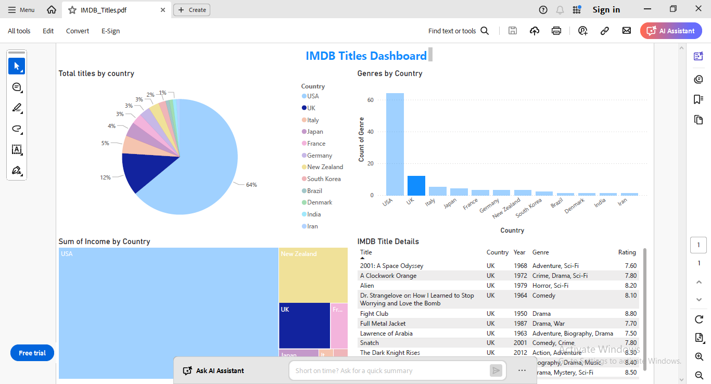

# IMDB Titles Dashboard

I have created IMDB Titles dashboard by taking dataset from Kaggle.

It has following fields:
IMBD title ID (Text)
Original title (Text)
Release year (Originally Date but converted to Numeric)
Genre  (Text)
Duration (Numeric - Whole Number in minutes)
Country (Text)
Content Rating (Text)
Director (Text)
Income (Numeric - Whole Number)
Votes (Numeric - Whole Number)
Score (Numeric - Decimal)

The dataset was messy and required several levels of cleaning.
(1) Converting dates to year
(2) Discarding irrelevant/non-existent dates 
(3) Removing blank records
(4) Replace Inf(Infinity), NaN(Not a Number), Not Applicable, - and Blank values with 0 or appropriate values (For numeric fields)
(5) Correct misspelled countries

Exact steps performed (With Power Query):

(1) Release Year would require several transformations.
-	Converting all dates to year
  
(2)	Duration is in minutes. Would require several transformations:
-	Replace Inf, NaN, Not Applicable, - and Blanks with 0. (Duration can never be 0 but here 0 means Unknown).
  
(3)	 Country would require several levels of cleaning.
-	Replace USA and US. with US everywhere.
-	Correct spellings of New Zealand.
-	Replace Italy1 with Italy.
-	West Germany and Germany are equal.

(4)	Content Rating
-	Replace Not Rated with N/A.
-	Keep N/A as it is.

(5)	Income field is entirely clean. Kept as it is.

(6)	Votes require cleaning (Numeric  field). Replace all . with ,

(7)	Score is out of 10 and requires cleaning. Replace and discard all values with average score (5) as it is a numeric field.

Preview:

